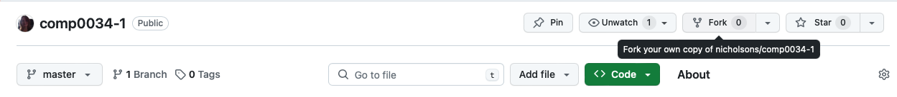
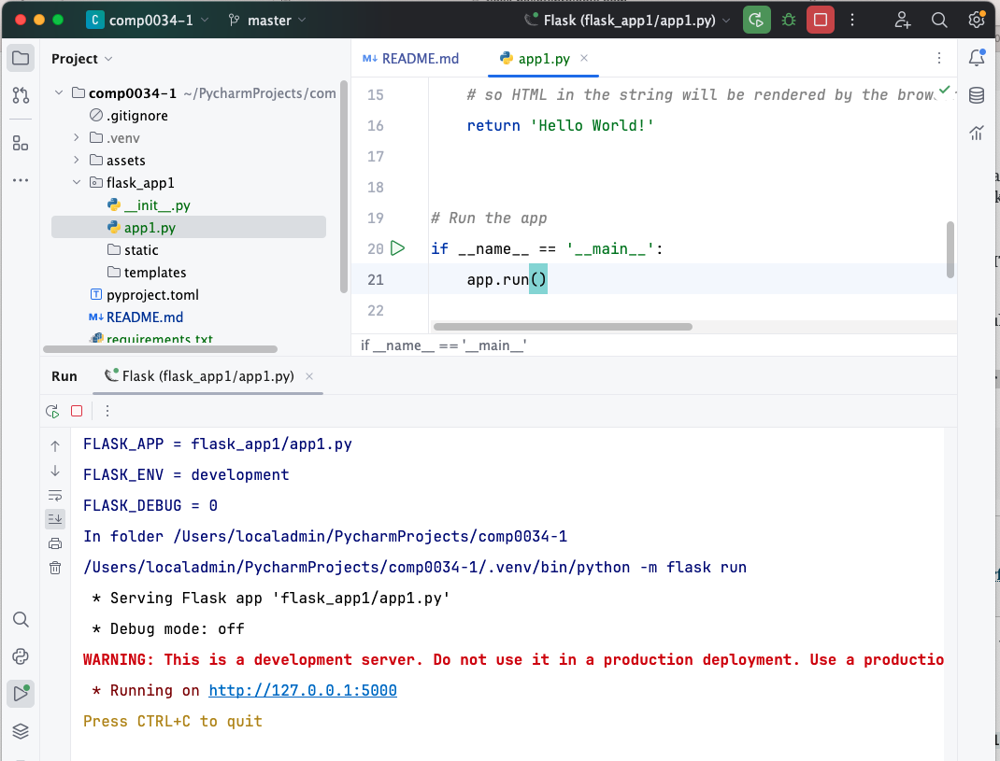
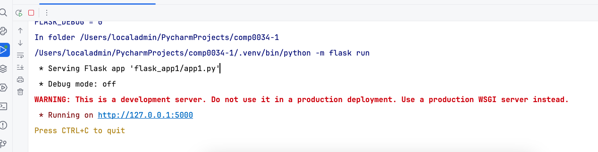

# Intro to basic Flask applications

_COMP0034 2023-24 Week 1 coding activities_

You are strongly advised to start these before the tutorial so that you have time to learn the basics and consider any
questions you may have.

## 1. Set up the project

1. Go to <https://github.com/nicholsons/comp0034-1>
2. Fork the repository. This creates a copy in your GitHub account.

   
3. Clone the repository from your GitHub account to your IDE.
    - [VS Code](https://code.visualstudio.com/docs/sourcecontrol/intro-to-git#_clone-a-repository-locally)
    - [PyCharm](https://www.jetbrains.com/help/pycharm/manage-projects-hosted-on-github.html#clone-from-GitHub)
4. [Create](https://packaging.python.org/en/latest/guides/installing-using-pip-and-virtual-environments/#create-a-new-virtual-environment)
   and [activate](https://packaging.python.org/en/latest/guides/installing-using-pip-and-virtual-environments/#activate-a-virtual-environment)
   a virtual environment in the project's folder in your IDE.
5. Install [Flask](https://pypi.org/project/Flask/) in the virtual environment e.g. `pip install Flask`
6. Enter the command `pip list` in the terminal. You should see that Flask and several dependencies have been installed
   e.g. Jinja2, MarkupSafe, Werkzeug, blinker, click, itsdangerous

## 2. Open and run a minimal Flask app

1. Open [flask_app1/app1.py](flask_app1/app1.py) and read the comments that explain what each line does.

2. Run the Flask app using the run function in the IDE (usually a green triangle in PyCharm and VS Code). You should see
   output in the terminal similar to the following:

   

3. Click on the URL which is likely to be the default <http://127.0.0.1:5000>. You should see your app in a browser.

   The app has been run on a development server and hosted on your machine at that URL. You are accessing your app
   locally. It is not accessible by anyone else.

   If another program is already using port 5000, you’ll see an OSError when the server tries to start. It may have one
   of the following messages:

   ```
   OSError: [Errno 98] Address already in use
   OSError: [WinError 10013] An attempt was made to access a socket in a way forbidden by its access permissions
   ```

   You can specify a different port number in the code that runs the app, e.g.:

   ```python
   if __name__ == '__main__':
       app.run(port=5001)
   ```

## 3. Run the app from the command line in Terminal

Another way to run the Flask app is to run it from the Terminal command line. This is the way that is recommended in the
Flask documentation and will be used in all future activities.

Use the `--app` option to point to your application, and the `--debug` option to enable debug mode.
Use `flask run --help` to see the available options.

```
flask --app flask_app1/app1.py run --debug
```

Add `--port 5001` (or any other port number that is not in use) to the end of the command chain if you need to change
the port number.

Try entering the above command in Terminal.

What happened?

You already have a running Flask app from the earlier activity. You will need to stop that app from running before you
try to start another on the same port.

## 4. Stop a running Flask app

If you ran the app in PyCharm you may have a button (red outlined square) in the interface that allows you to stop the
app. If so, press this.



Otherwise, you will need to stop it from the command line interface (CLI) by pressing the `ctrl` and `c` keys at
the same time. If you look at the CLI in the image above you can see that you are told to do this.

Stop the running app using `CTRL+C`.

Now go back to Terminal and start the app from the command line using `flask --app flask_app1/app1.py run --debug` (
add `--port 5001` to the end of the command chain if you need to change the port number).

## 5. View and run a Flask app that uses a template and .CSS styling

You will not learn HTML and Jinja templates until after reading week. However, so you can see the difference, open the
flask_app2 folder.

- `static` contains CSS and JavaScript files. The files in the folders are downloaded
  from [Bootstrap](https://getbootstrap.com).
- `templates` contains two files. These have a parent/child relationship where the child inherits all the parent's
  content:

    - `layout.html`, the parent. A mix of HTML that defines the page layout, and Jinja that defines blocks, areas that
      child pages can implement.
    - `index.html`, the child. A mix of HTML and Jinja. The layout is inherited from `layout.html` and then the Jinja
      blocks for the page title and content are specified for this page.

Run the app from the Terminal command line in your IDE. You should see the styling (e.g. font, page margins) looks
different.

`flask --app flask_app2/app2.py run --debug`

Don't forget to stop the running app using `CTRL+C` in the command line interface.

## 6. Create a basic Flask app for the paralympics app

In the paralympics folder, create an appropriately named python file and add code to create a basic app with a home page
message.

You can give the python file any name except for flask.py (calling it `flask.py` would conflict with Flask itself.).

> Challenge: try and add a variable route that allows the user to enter their name and a personalised homepage message
> e.g. 'Hello _name_ and welcome to my paralympics app'.
>
> See Flask documentation:
> - [HTML escaping](https://flask.palletsprojects.com/en/2.3.x/quickstart/#html-escaping)
> - [Variable routes](https://flask.palletsprojects.com/en/2.3.x/quickstart/#variable-rules)

Make sure you can run and stop the paralympics app.

A solution will be given in next week's coding activities.

## 7. Start the coursework

1. Read the specification.
2. Sign in to GitHub.
3. Use the correct link (individual/group) to create the coursework repository from the GitHub classroom:

    - [COMP0034 Coursework 2 (Individual)](https://classroom.github.com/a/H-Z2Ab1c)
        - Accept the assignment.
        - Accept to join the ucl-comp0035 organisation if prompted
    - [COMP0034 Coursework 1 (Group)](https://classroom.github.com/a/z2jRn9PD)
        - **One person only (first person from the group)**
        - Accept the assignment.
        - If prompted, accept to join the comp0035-ucl organisation.
        - Create the group (team) using the same name as your Moodle group name (e.g. Group_01, Group_02 etc.).
        - **All other group members**
        - Accept the assignment.
        - If prompted, accept to join the comp0035-ucl organisation.
        - Select your group (team) name from the list.
4. Find the repository you just created in the [ucl-comp0035 organisation](https://github.com/ucl-comp0035)
5. Clone your repository to your IDE (e.g. VS Code, PyCharm).
6. Create and activate a virtual environment.
7. Install Flask in the virtual environment e.g. `pip install Flask`
8. Create a README.md
9. Create a requirements.txt
10. Create an 'src' directory in the project files (or create a directory with your app's name if you prefer)
11. Create a pyproject.toml
12. Create a 'data' directory and add your data file(s) (.csv, .xlsx)
13. Create an appropriately named python file in the directory created at step 10. Add code to create a basic Flask app.
14. Commit and push the changes to GitHub.
15. Make sure your Flask app can run and be stopped.

Steps 2 - 11 were covered several times in COMP0035 so are no longer repeated in detail in this course. Refer to
tutorials 1 and 2 in COMP0035.